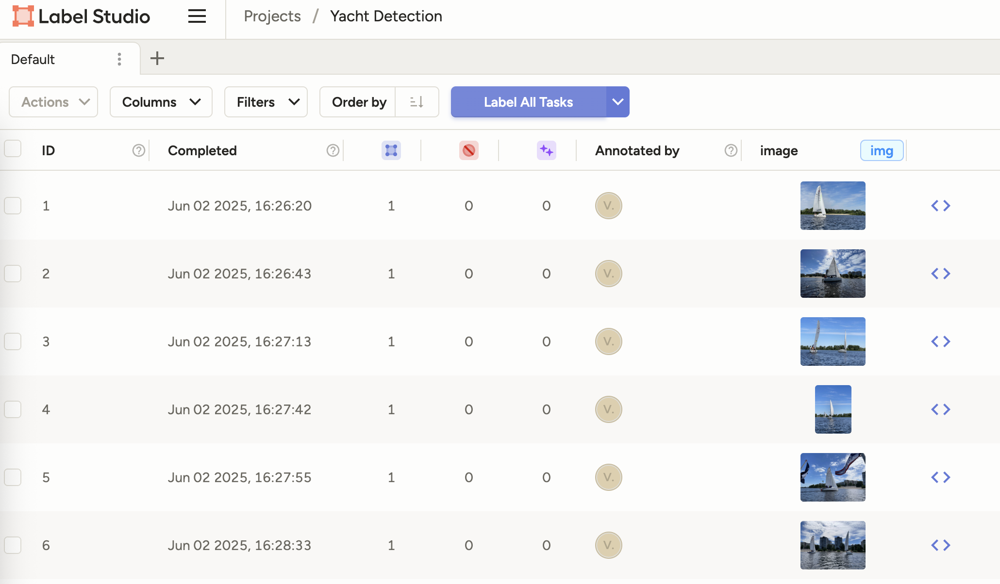

# Yacht Detection Dataset Annotation Project

## Project Structure

```
set-mlops/
├── docker-compose.yml         # Docker Compose stack for Label Studio, MinIO, PostgreSQL
├── mydata/                    # Label Studio data (annotation projects, exports)
├── minio-data/                # MinIO S3-compatible object storage (ignored by Git)
├── postgres-data/             # PostgreSQL database data (ignored by Git)
├── docs/                      # Documentation and images
├── .dvc/                      # DVC configuration and cache
├── .gitignore                 # Git ignore rules (excludes data, includes DVC metadata)
├── README.md                  # Project documentation
└── minio-data/yacht-dataset.dvc # DVC tracking file for the dataset (tracked by Git)
```

## Project Demo Video

Watch a walkthrough of the annotation and dataset versioning workflow on Loom:

[Loom Video Demo](https://www.loom.com/share/3f039bdc6fb04d45915bdfafa2d57be0)

## Annotation Tool

We use **Label Studio** ([heartexlabs/label-studio](https://github.com/heartexlabs/label-studio)) for image annotation.  
Label Studio is a flexible, open-source data labeling tool that supports a wide range of data types and integrates seamlessly with cloud storage.



## Dataset Versioning with DVC

We use [DVC (Data Version Control)](https://dvc.org/) to version and manage our dataset:

- **Source dataset:** `minio-data/yacht-dataset`
- **Remote storage:** MinIO S3-compatible bucket `yacht-dvc-storage`

**How to use DVC for dataset versioning:**

```sh
# Initialize DVC (run once)
dvc init

# Track the dataset directory
dvc add minio-data/yacht-dataset

# Configure MinIO as a DVC remote
dvc remote add -d yacht-s3 s3://yacht-dvc-storage/yacht-dataset
dvc remote modify yacht-s3 endpointurl http://localhost:9000
dvc remote modify yacht-s3 access_key_id minioadmin
dvc remote modify yacht-s3 secret_access_key minioadmin
dvc remote modify yacht-s3 use_ssl false

# Push data to the remote bucket
dvc push

# Commit DVC tracking files to Git
git add .dvc/config .gitignore minio-data/yacht-dataset.dvc
git commit -m "Track dataset with DVC and configure MinIO remote"
git push
```

This setup allows you to version, share, and reproduce your dataset using DVC and MinIO.

## How to Launch the Annotation Platform

1. **Clone the repository and enter the project directory:**
   ```sh
   git clone https://github.com/voa/set-mlops.git
   cd set-mlops
   ```

2. **Start the annotation stack with Docker Compose:**
   ```sh
   docker-compose up -d
   ```

3. **Access services:**
   - **Label Studio:** [http://localhost:8080](http://localhost:8080)
   - **MinIO Console:** [http://localhost:9009](http://localhost:9009)  
     (default login: `minioadmin` / `minioadmin`)

4. **Cloud Storage Buckets:**
   - `yacht-dataset` — Source images for annotation
   - `yacht-labeled-dataset` — Target bucket for labeled data

## Dataset Versioning

- **MinIO** acts as an S3-compatible object storage, allowing you to organize and version datasets using buckets.
- **Source bucket:** `yacht-dataset` contains the raw images to be annotated.
- **Target bucket:** `yacht-labeled-dataset` stores the resulting annotated data.
- You can use MinIO’s versioning features or external tools (like DVC or custom scripts) to manage dataset snapshots and history.

## Future Use of the Data

The annotated data will be used for:
- Training and validating **machine learning models** for yacht detection and classification.
- Research and development of computer vision algorithms in maritime environments.
- Potential deployment in real-time detection systems or analytics dashboards.

## Additional Notes

- All annotation and storage services run locally via Docker Compose for easy setup and reproducibility.
- To stop the stack:  
  ```sh
  docker-compose down
  ```
- Make sure to back up your `mydata/`, `minio-data/`, and `postgres-data/` folders to preserve your work.

## YOLO Object Detection on Ray

This project includes a complete solution for training and serving YOLOv8 object detection models using Ray on a Kubernetes cluster.

### Training YOLO Models

The [`yolo-cpu/train`](yolo-cpu/train) directory contains scripts for training YOLOv8 models using Ray distributed computing:

- **Scripts**:
  - [`train_yolo.py`](yolo-cpu/train/train_yolo.py) - Core training script with W&B integration
  - [`ray_job.py`](yolo-cpu/train/ray_job.py) - Ray job definition for distributed training
  - [`submit_job.py`](yolo-cpu/train/submit_job.py) - Submit training jobs to Ray cluster

- **Usage**:
  ```bash
  cd yolo-cpu/train
  python submit_job.py --ray-address ray://167.235.85.116:10001
  ```

- **Documentation**: For detailed information, see [yolo-cpu/train/README.md](yolo-cpu/train/README.md)

### Serving YOLO Models

The [`yolo-cpu/serve`](yolo-cpu/serve) directory contains scripts for deploying trained models with Ray Serve:

- **Scripts**:
  - [`serve_yolo.py`](yolo-cpu/serve/serve_yolo.py) - Ray Serve application for YOLO inference
  - [`simple_deploy.py`](yolo-cpu/serve/simple_deploy.py) - Deployment script for Ray cluster
  - [`client.py`](yolo-cpu/serve/client.py) - Test client for sending images and visualizing predictions

- **Usage**:
  ```bash
  # Deploy the model
  cd yolo-cpu/serve
  python simple_deploy.py --ray-address ray://167.235.85.116:10001
  
  # Test the model
  python client.py --url http://167.235.85.116:8000 --image test.jpg
  ```

- **API Endpoint**: http://167.235.85.116:8000
- **Dashboard**: http://167.235.85.116:8265

- **Documentation**: For detailed information, see [yolo-cpu/serve/README.md](yolo-cpu/serve/README.md)

### Ray Infrastructure

The Ray cluster is deployed in the `shalb-mlops` Kubernetes namespace using Helm. The cluster consists of a head node and worker nodes, exposed via a LoadBalancer service that consolidates all required ports:

- Port `10001` - Ray Client API
- Port `8265` - Ray Dashboard 
- Port `8000` - Ray Serve API for model inference

Infrastructure configuration files are located in the [`infra/`](infra) directory.
